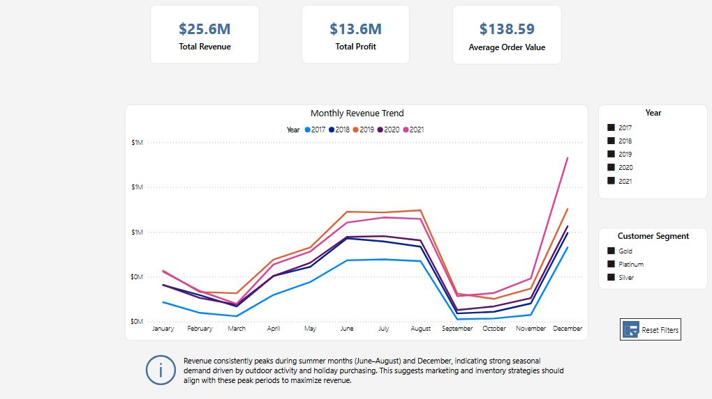
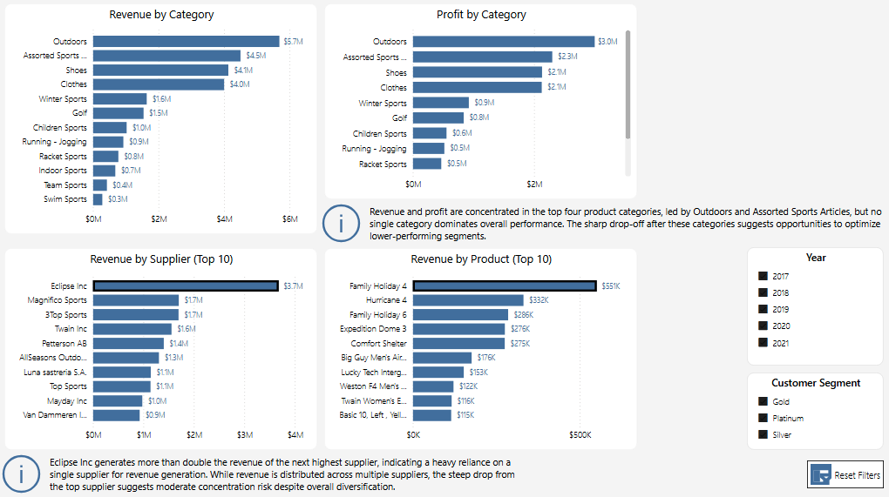
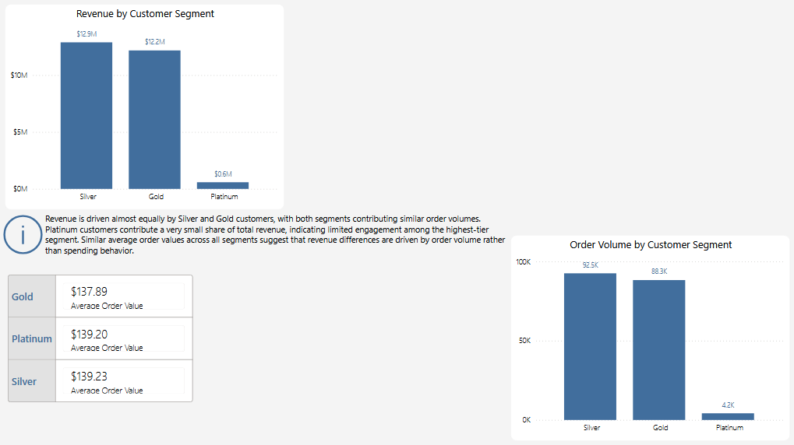

# Wholesale & Retail Sales Analysis (SQL + Power BI)

## Dashboard Preview

### Executive Overview

---

### Product & Supplier Performance

---

### Customer Analysis

---

## Project Overview

This project analyzes wholesale and retail order data using SQL Server and Power BI to uncover trends in revenue, profitability, product performance, supplier dependency, and customer behavior.

The project focuses on building a complete analytics workflow, including:

- Data ingestion and validation in SQL  
- Data modeling using fact and dimension tables  
- Data transformation and cleaning  
- Analytical query development  
- Interactive dashboard creation in Power BI  

The goal was to simulate a real-world data analyst workflow, from raw data to business insights, while delivering a clean and structured reporting solution.

---

## Dataset

The dataset consists of wholesale and retail order data stored in CSV format and imported into SQL Server.

It includes:

- Order transactions  
- Product and supplier information  
- Customer identifiers and segmentation  
- Order and delivery dates  
- Pricing and cost data  

Key fields include:

- `orderID`, `customerID`, `productID`  
- `dateOrderPlaced`, `deliveryDate`  
- `quantityOrdered`, `totalRetailPrice`, `costPricePerUnit`  
- `productCategory`, `productName`  
- `supplierName`, `supplierCountry`  
- `customerStatus`  

---

## Data Pipeline (SQL)

The data pipeline was built in SQL Server and structured into multiple stages:

### 1. Schema Creation
- Created normalized tables:
  - `Orders` (fact table)  
  - `Products`, `Suppliers`, `Customers` (dimension tables)  
- Defined primary and foreign key relationships  

---

### 2. Data Validation
- Checked for:
  - Duplicate keys  
  - Null values in key columns  
  - Inconsistent values (e.g., customer status formatting)  
  - Logical issues (e.g., delivery date before order date)  

---

### 3. Data Transformation
- Split raw data into structured tables  
- Removed duplication through normalization  
- Established relationships between entities  

---

### 4. Data Cleaning
- Standardized categorical values (e.g., customer status formatting)  
- Ensured consistency across dimensions  

---

### 5. Analysis Queries
- Developed SQL queries to calculate:
  - Revenue and profit  
  - Revenue by category, supplier, and customer segment  
  - Average order value  
  - Seasonal revenue trends  
  - Top-performing products  

---

## Data Model

The final model follows a **star schema** structure:

- **Fact Table:**
  - `Orders` (transaction-level data)

- **Dimension Tables:**
  - `Products`  
  - `Suppliers`  
  - `Customers`  
  - `Calendar` (created in Power BI)

This structure enables efficient aggregation and analysis across multiple business dimensions.

---

## Key Metrics

- Total Revenue  
- Total Profit  
- Average Order Value  
- Order Volume  
- Revenue by Category  
- Profit by Category  
- Revenue by Supplier  
- Revenue by Customer Segment  
- Monthly Revenue Trend  

---

## Dashboard Pages

### Executive Overview
- KPI summary (Revenue, Profit, Average Order Value)  
- Monthly revenue trend with year comparison  
- Seasonal trend analysis  
- Customer segment and year filtering  
- Key business insight  

---

### Product & Supplier Performance
- Revenue by product category  
- Profit by product category  
- Top suppliers by revenue  
- Top products by revenue  
- Supplier dependency analysis  
- Key business insights  

---

### Customer Analysis
- Revenue by customer segment  
- Order volume by customer segment  
- Average order value comparison (supporting metric)  
- Customer behavior analysis  
- Key business insight  

---

## Key Insights

- Revenue shows strong seasonality, peaking during summer months (June–August) and December  
- Revenue and profit are concentrated in the top four product categories, with no single category dominating overall performance  
- A single supplier (Eclipse Inc) generates more than double the revenue of the next highest supplier, indicating potential concentration risk  
- Silver and Gold customers contribute nearly equal revenue, while Platinum customers represent a very small share  
- Revenue differences across customer segments are driven by order volume rather than spending behavior  
- Average delivery times across suppliers are consistently low (0–1 days), indicating efficient fulfillment operations  

---

## Dashboard Access

The interactive Power BI dashboard is included as a `.pbix` file in this repository.

To view:

1. Download the `.pbix` file  
2. Open it using Power BI Desktop  

*Note: A public Power BI Service link is not available due to workspace restrictions.*

---

## Tools Used

- SQL Server  
- Power BI  
- DAX  
- Power Query  
- Data Modeling (Star Schema)  

---
